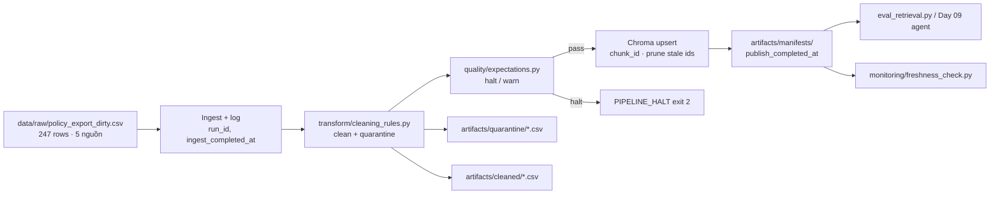

# Kiến trúc pipeline — Lab Day 10

**Nhóm:** DoanMinhQuang  
**Cập nhật:** 2026-06-10

---

## 1. Sơ đồ luồng



**Điểm đo observability:**

| Boundary | Timestamp | File |
|----------|-----------|------|
| Ingest xong | `ingest_completed_at` | `artifacts/logs/run_<run-id>.log` |
| Publish index | `publish_completed_at` | `artifacts/manifests/manifest_<run-id>.json` |
| Freshness SLA | so sánh `latest_exported_at` vs 24h | log dòng `freshness_check=` |

---

## 2. Ranh giới trách nhiệm

| Thành phần | Input | Output | Owner nhóm |
|------------|-------|--------|------------|
| Ingest | CSV raw export | `raw_records`, log | DoanMinhQuang |
| Transform | Raw rows | `cleaned_*.csv`, `quarantine_*.csv` | DoanMinhQuang |
| Quality | Cleaned rows | expectation OK/FAIL, halt | DoanMinhQuang |
| Embed | Cleaned CSV | Chroma `day10_kb`, `embed_upsert` | DoanMinhQuang |
| Monitor | Manifest JSON | PASS/WARN/FAIL freshness | DoanMinhQuang |

---

## 3. Idempotency & rerun

- **Upsert** theo `chunk_id` ổn định (hash `doc_id|text|seq`).
- Sau mỗi run, **prune** vector id không còn trong cleaned (`embed_prune_removed` trong log) — tránh chunk cũ trong top-k sau inject.
- Rerun `python etl_pipeline.py run --run-id clean-final` 2 lần: `cleaned_records=33`, collection size không phình (33 chunk).

---

## 4. Liên hệ Day 09

Pipeline Day 10 nuôi **cùng domain** CS + IT Helpdesk (`data/docs/`) nhưng qua lớp **export CSV** mô phỏng ingest từ DB. Collection `day10_kb` (Chroma local) là snapshot publish sau clean/validate — tương đương corpus mà `retrieval_worker` Day 09 cần. Agent Day 09 chỉ trả lời đúng khi index được rebuild từ pipeline này (không dùng raw CSV trực tiếp).

**Lệnh một dòng end-to-end:**

```bash
python etl_pipeline.py run --run-id clean-final && python grading_run.py --out artifacts/eval/grading_run.jsonl
```
